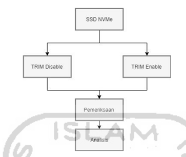

# **TUGAS 1**
### Komputer dan Masyarakat
---

### Oleh:

* Cahya Kamila Maulida (1910131220013)
* Esty Hairina (1910131320007)

Hari Tanggal	: Senin, 22 Agustus 2022

#

#### **Buat kajian bagaimana keterlibatan Informasi dan Teknologi (IT) dalam mengurai kasus di kepolisian yang sedang viral saat ini, seperti kasus pada CCTV dan peran pakar digital forensik!**

---
Pemberitaan yang tengah hangat diperbincangankan saat ini adalah kasus polisi tembak polisi. Kasus ini menjadi ramai muncul ke publik bermula karena meninggalnya seorang Brigadir. Pada Senin (11/7/2022), kabar meninggalnya seorang Brigadir J diketahui banyak orang termasuk keluarganya. Brigadir J adalah seorang anggota Brimob yang dikabarkan meninggal dunia usai baku tembak (Sumber: https://manado.tribunnews.com/2022/07/15/awal-mula-kasus-polisi-tembak-polisi-terungkap-sebab-ajudan-kadiv-propam-brigadir-j-meninggal-dunia). Pada tulisan ini kami tidak akan membahas mengenai kasusnya akan tetapi teknologi yang terlibat di dalamnya.
#
Dari banyaknya berita yang kami temukan ada keterlibatan IT yakni pada CCTV yang dikatakan rusak. "Kami juga mendapatkan bahwa di rumah tersebut CCTV-nya rusak kurang lebih dua minggu yang lalu,. Sehingga, tidak dapat kami dapatkan (rekamannya)," imbuh Budhi di Mapolres Jaksel, Selasa (12/7) (Sumber: https://www.cnnindonesia.com/nasional/20220821071928-12-837041/misteri-cctv-di-rumah-dinas-ferdy-sambo-rusak-tapi-kini-ditemukan). Selain itu dari sumber lainnya, berdasarkan hasil wawancara dengan seorang wartawan Tempo, Riky Ferdianto yang kami temukan yaitu pada link: https://www.youtube.com/watch?v=uZvkcrPonnk terdapat bukti pendukung yaitu CCTV yang diperoleh oleh tim penyelidik dari pos satpam, yang mana kamera ini yang disebut kamera sempat hilang dan belakangan ketika ditelusuri ternyata itu sempat diamankan oleh sejumlah orang perwira menengah di Propam Yati. Dan barang itu sempat ditemukan salinan / copyan yang digandakan di external harddisk, salinan tu dimpan di laptop dan laptopnya sendiri kondisinya rusak. Laptop yang rusak ini kemudian menjadi dasar tim khusus untuk menyeret dan meminta pertanggungjawaban kepada sejumlah perwira tinggi dan perwira menengah di program.
#
Dari Ahli Digital Forensik Abimanyu Wachjoewidajat. Bagi Abimanyu ada dua kemungkinan dari keberhasilan kepolisian mendapatkan kembali digital video recorder (DVR) CCTV yang sebelumnya disebut menghilang dan rusak.

* Kemungkinan pertama, perangkat yang rusak bukanlah hardisk atau perangkat penyimpanan sehingga data bisa dipulihkan kembali atau recovery.

* Kemungkinan kedua yakni CCTV dan DVR memang sudah dihilangkan atau dirusak.
Namun sebelum dilakukan pemusnahan, data sempat dicadangkan ke perangkat lain. Kemungkinan kedua ini diketahui Abimanyu dari konferensi pers kepolisian yang menjelaskan sejumlah barang bukti yang disita kepolisian, yakni empat hardisk eksternal merek WD, tablet, DVR CCTV yang ada di Duren Tiga, laptop merek Dell. "Jadi ada kemungkinan memang sudah dirusak, tetapi sempat dicopy, sudah disalin ke komputer. Karena ada komponen tersebut, (barang bukti) saya yakin sebelumnya sudah di-backup," 
(Sumber: https://www.tribunnews.com/nasional/2022/08/22/4-alasan-cctv-di-rumah-ferdy-sambo-kemungkinan-sudah-diedit-menurut-ahli-digital-forensik).

#

Forensik digital sebagai bidang ilmu yang digunakan untuk menyelidiki bukti digital, bertujuan untuk pengumpulan, mengembalikan bukti digital, dan analisis bukti digital tersebut, yang terdapat pada kejahatan komputer melalui perangkat komunikasi seperti smartphone, tablet, laptop atau pengguna komputer lainnya (Pranoto, 2020). Forensik digital akan melakukan pemeriksaan setiap barang bukti elektronik dalam rangka mencari data-data digital yang berkaitan dengan kasus kejahatan dan pelakunya. Dalam tesis yang ditulis oleh (Pranoto, 2020) terdapat kasus seperti kemungkinan pertama yang disebutkan oleh Ahli Digital Forensik Abimanyu Wachjoewidajat dimana perangkat yang rusak bukanlah hardisk atau perangkat penyimpanan sehingga data bisa dipulihkan kembali atau recovery. 

Berikut simulasi kasus yang serupa dengan kasus di atas.

* Simulasi kasus dengan 2 komputer atau laptop yang digunakan dalam eksperimen ini. Komputer pertama akan dilakukan pemasangan SSD NVMe didalamnya menggunakan sistem operasi microsoft windows 10. Pada komputer tersebut akan dilakukan pembagian 2 partisi dimana partisi kedua digunakan untuk kebutuhan penyimpanan file yang akan dilakukan manipulasi. Kemudian pada komputer kedua sebagai laptop investigator untuk analisis hasil live akuisisi dan recovery SSD NVMe pada komputer pertama yang telah dilakukan skenario dan simulasi.

#

Langkah-langkah pengembalian data tersebut adalah sebagai berikut.

Pada tahapan ini dilakukan proses investigasi live forensik terhadap simulasi kasus komputer pertama yang menggunakan SSD NVMe dilakukan pembagian 2 partisi. Investigasi yang dilakukan diantaranya yaitu proses pencarian tempat penyimpanan pada partisi ke 2, live akuisisi recovery, melakukan pemeriksaan dan menganalisis data hasil akuisisi recovery tersebut. Komputer pertama yang akan diakuisisi nantinya berjalan di atas sistem operasi windows 10 pro dan fungsi TRIM disable ataupun enable, kemudian file-file akan diakuisisi hanyalah file non-volatile yang bersangkutan dengan kasus. Kemudian perlu dilakukan proses pencarian lokasi penyimpanan file dalam komputer pertama. Selanjutnya menerapkan live forensik terhadap komputer pertama, karena dilakukannya dengan live forensik maka keadaan komputer sistem operasi windows 10 tidak dimungkinkan untuk dimatikan. Jika mematikan perangkat komputer tentu akan mematikan keseluruhan sistem yang sedang berjalan dan akan mengganggu keseluruhan sistem, maka peneliti perlu mengkoneksikan kabel usb SSD SATA (eksternal) untuk melakukan live akuisisi dan recovery data pada kasus tersebut. Tahapan investigasi forensik yang akan dilakukan untuk mengakuisisi SSD NVMe sebagai berikut.

